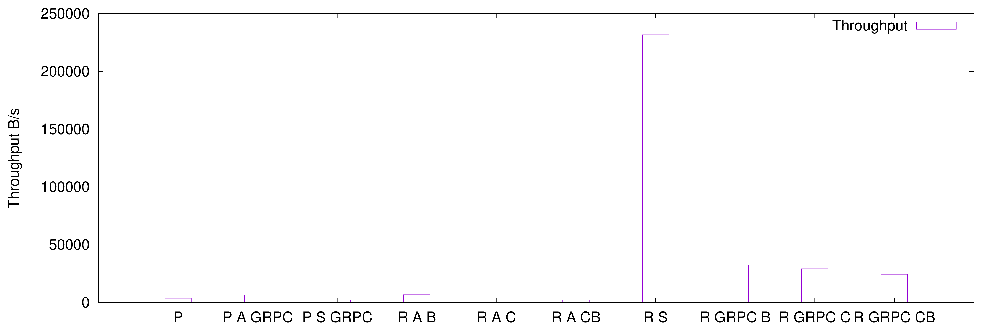
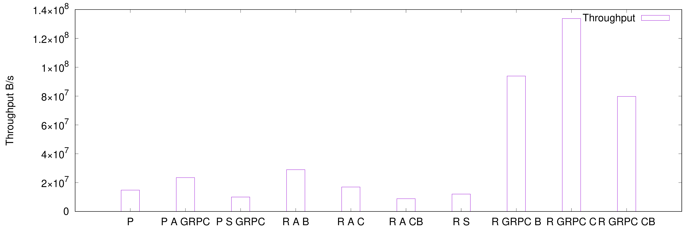
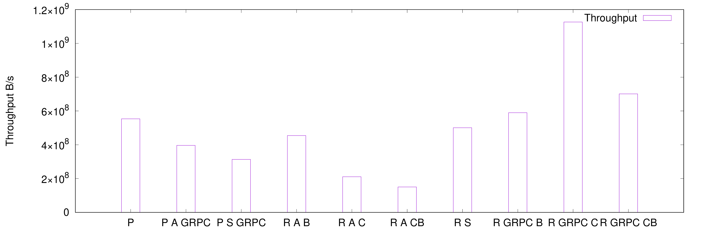
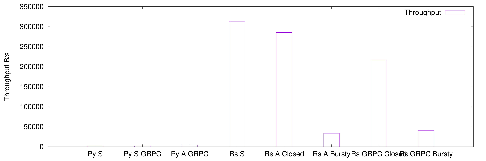
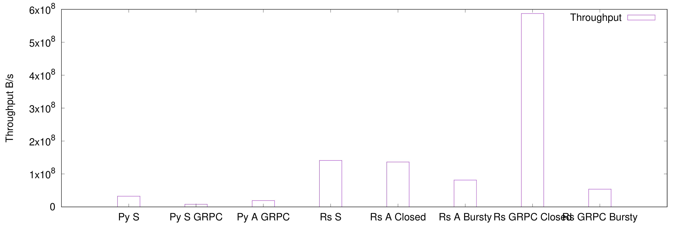
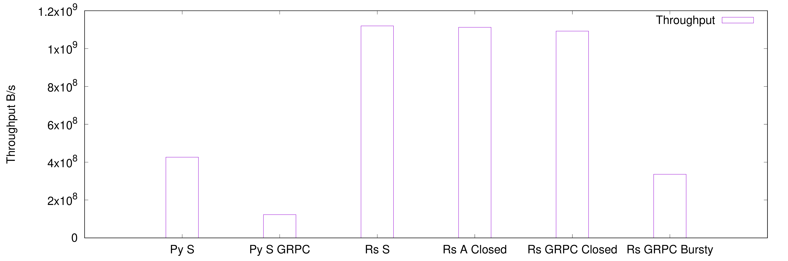

# Result Report

## Single node

This experiment ran on a single machine (both server and client).

```
Architecture:                    x86_64
CPU op-mode(s):                  32-bit, 64-bit
Byte Order:                      Little Endian
Address sizes:                   39 bits physical, 48 bits virtual
CPU(s):                          8
On-line CPU(s) list:             0-7
Thread(s) per core:              2
Core(s) per socket:              4
Socket(s):                       1
NUMA node(s):                    1
Vendor ID:                       GenuineIntel
CPU family:                      6
Model:                           158
Model name:                      Intel(R) Xeon(R) E-2174G CPU @ 3.80GHz
Stepping:                        10
CPU MHz:                         3800.000
CPU max MHz:                     4700.0000
CPU min MHz:                     800.0000
BogoMIPS:                        7599.80
Virtualization:                  VT-x
L1d cache:                       128 KiB
L1i cache:                       128 KiB
L2 cache:                        1 MiB
L3 cache:                        8 MiB
NUMA node0 CPU(s):               0-7
```

### Tiny (1B)



### Small (4KB)



### Medium (256KB)



### Comment

Key:
- `P`: python
- `P S GRPC`: python with grpc
- `P A GRPC`: python with asyncio grpc
- `R S`: rust sync
- `R A B`: rust async bursty
- `R A CB`: rust async controlled bursty
- `R A C`: rust async closed
- `R GRPC B`: rust grpc (tonic) bursty
- `R GRPC CB`: rust grpc (tonic) controlled bursty
- `R GRPC C`: rust grpc (tonic) closed

Async modes:
- Bursty: all requests are pushed out at the same time (tests how good the scheduler/poller is)
- Controlled Bursty: a chunk of requests is pushed out at the same time
- Closed: X worker futures are awaiting on requests synchronously

Overall conclusions:
- Rust generally outperforms python
- Rust synchronous woks very well for tiny objects
- Rust with GRPC (tonic) is reasonably tuned
- The preferred client mode for rust is closed

---
---

## Distributed

This experiment ran on cloudlab.
- 6 `rs630` instances;
- Using the `small-lan` profile with 10Gb/s;
- Using one of the instances as the server and the remaining ones as clients.


### Tiny (1B)



### Small (4KB)



### Medium (256KB)



### Comment

Key:
- `Py S`: python synchronous
- `Py S GRPC`: python with grpc
- `Py A GRPC`: python with asyncio grpc
- `Rs S`: rust sync
- `Rs A B`: rust async bursty
- `Rs A C`: rust async closed
- `Rs GRPC B`: rust grpc (tonic) bursty
- `Rs GRPC C`: rust grpc (tonic) closed

Async modes:
- Bursty: a chunk of requests is pushed out at the same time
- Closed: X worker futures are awaiting on requests synchronously

Overall conclusions:
- Rust generally outperforms python
- Rust with GRPC (tonic) is reasonably tuned
- Anything other than closed sucks
- Even though the machines are different, we need multiple clients to saturate
